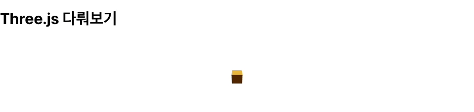
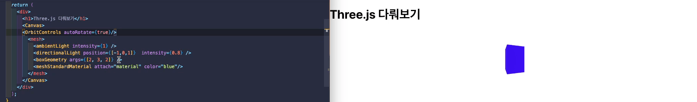

# Threejs 사용해보자. 

```bash
yarn add three  @react-three/fiber  @react-three/drei
```
- three : Three.js 라이브러리이고
- react-three-fiber 를 리액트 문법에 맞게 사용하도록 도와주는 패키지라면
- react-three/drei는 이를 더 쉽게 도와주는 라이브러리라고 한다. 

### Three.js 기본구조 
- 렌더러 : 카메라에 담긴 장면을 웹사이트에 구현해주는 렌더러
- 씬 : 배경색, 안개 등의 요소를 포함하여, 여러개의 3D 오브젝트와 빛들이 모인 장면 포함한 최상위 노드
- 카메라 : 씬에 담긴, 시야각, 종횡비, 카메라 시작 끝 지점, 카메라 위치 등을 설정할 수 있다. 

1. 장면, 카메라, 렌더러 만들기 
    - 바닐라JS로 만든다면 아래와 같은 과정이 필요하다. 
      ```javascript 
      const scene = new THREE.Scene();
      const camera = new THREE.RerspetiveCamera(75, window.innerWidth / window.innerHeight, 0.1, 1000)
      const renderer = new THREE.WebGLRenderer()
      rederer.setSize(window.innerWidth, window.innerHeight)
      document.body.appendChild(renderer.domElement)
      renderer.render(sene, camera)
      ```
    - 그러나 리액트에서는 `React Three Fiber`를 통해 간편하게 위의 환경을 세팅할 수 있다. 
    - `<Canvas>`는 Html5 캔버스 태그가 아닌, 라이브러리에서 가져온 특별한 컴포넌트이다. 이를 통해 복잡한 환경설정이 간편해졌다. 

      ```jsx
      import React from 'react'
      import {Canvas} from '@react-three/fiber'

      function App() {
        return (
          <div>
            <Canvas/>
          </div>
        )
      }

      export default App
      ```  

2. [공식문서](https://docs.pmnd.rs/react-three-fiber/getting-started/your-first-scene), 메쉬 구성
    - `<mesh />`는 장면에서 실제로 무언가를 보기 위해 `new THREE.Mesh()`와 직접적으로 동일한 소문자 기본 요소로 추가한다. 
    - `<mesh />`는 three.js의 기본 장면 개체이며, 3D 공간에서 모양을 나타내는 데 필요한 형상과 재료를 유지하는 데 사용된다. 
    - 아래의 코드가 공식문서에서 제공하는 기본코드이다. 

      ```jsx
      import React from "react";
      import { Canvas } from "@react-three/fiber";

      function App() {
        return (
          <div>
            <h1>Three.js 다뤄보기</h1>
            <Canvas>
              <mesh>
                <boxGeometry />
                <meshStandardMaterial />
              </mesh>
            </Canvas>
          </div>
        );
      }

      export default App;
      ```

      <details>  
      <summary>그리고 이를 바닐라JS로 이를 작성하려면 아래와 같은 코드가 기록되어야 한다. </summary>

      ```javascript 
      const scene = new THREE.Scene()
      const camera = new THREE.PerspectiveCamera(75, width / height, 0.1, 1000)

      const renderer = new THREE.WebGLRenderer()
      renderer.setSize(width, height)
      document.querySelector('#canvas-container').appendChild(renderer.domElement)

      const mesh = new THREE.Mesh()
      mesh.geometry = new THREE.BoxGeometry()
      mesh.material = new THREE.MeshStandardMaterial()

      scene.add(mesh)

      function animate() {
        requestAnimationFrame(animate)
        renderer.render(scene, camera)
      }

      animate()
      ```
      </details>

      - `<boxGeometry args={[2, 2, 2]} />`와 같이 선택적으로 너비, 길이 및 깊이에 대한 세 가지 인수를 설정할 수 있다. 
      - 조명과 소품에 대한 설정은 아래와 같이 추가된다. 

        ```jsx
        <Canvas>
        <ambientLight intensity={0.1} />
        // intensity : (선택 사항) 조명 강도/강도의 숫자 값으로, 기본값은  1 이다. 
        <directionalLight color="red" position={[0, 0, 5]} />
        // directionalLight 에서는 색상 백터 등에 대한 소품을 추가할 수 있다. 
        ```

3. 쥐콩만한 3D 상자 만들어보기 

    
      <details>
      <summary>코드 살펴보기 </summary>

      ```jsx
      import React, { useState } from "react";
      import { Canvas, useFrame } from "@react-three/fiber";

      function App() {
        
        return (
          <div>
            <h1>Three.js 다뤄보기</h1>
            <Canvas>
              <MyRotatingBox/>
              <ambientLight intensity={0.1} />
              <directionalLight/>
            </Canvas>
          </div>
        );
      }

      export default App;


      function MyRotatingBox ()  {
        const myMesh = React.useRef();
        const [active, setActive] = useState(false);
        useFrame(({ clock }) => {
          const a = clock.getElapsedTime();
          myMesh.current.rotation.x = a; // a 값을 통해, x축을 중심으로 -1과 1 라디안 사이에서 무한 회전이 된다고 한다. 
        });
        /* 
          애니메이션의 기본 빌딩 블록으로 전달되는 콜백은 useFrame 모든 프레임에서 실행되며, Fiber장면의 상태를 포함한 객체로 전달된다. 
          예를들어 매개 clock 변수에서 시간 정보를 추출하여 애플리케이션에서 경과된 시간을 파악하고 해당 시간을 사용하여 애니메이션화 한다. 
          clock 애니메이션은 총 경과 시간을 가져오는 Three.js Clock 개체인데, 초기값은 0 이다. (a)

          또한 mesh에 useRef를 할당하여, 매 프레임마다 메시를 직접 번경하며, Reference를 통해 a를 가져오는 것을 볼 수 있다. 
        */ 

        return (
          <mesh 
          scale={active ? 1.5 : 1} // 크기를 조절 하는 값을 active 상태를 통해서 제어할 수 있다.
          onClick={()=> setActive(!active)} 
          ref={myMesh}
        >
          <boxGeometry />
          <meshStandardMaterial color="orange"/>
        </mesh>
        )
      }
      ```
      </details>

      - 작성에 있어서 주의할 점이 있다. THREE.js의 `useFrame` Hooks는 `<Canvas>` 컴포넌트에서 한 깊이 들어가서 만들어야 한다. 
      - `<Canvas>`가 있는 해당 컴포넌트에서 `useFrame`를 사용하면, 호출이 잘못되었다는 경고를 볼 수 있다. 
      <br/><br/>

      

      <details>
      <summary>코드 살펴보기 </summary>

      ```jsx
      import React from "react";
      import { Canvas } from "@react-three/fiber";
      import { OrbitControls } from '@react-three/drei';

      function App() {
        
        return (
          <div>
            <h1>Three.js 다뤄보기</h1>
            <Canvas>
            <OrbitControls autoRotate={true}/> 
              // autoRotate 자동으로 개체를 회전시키겠다는 속성이다. 
              <mesh>
                <ambientLight intensity={1} />
                <directionalLight position={[-1,0,1]} intensity={0.8} /> 
                // position 카메라의 위치인데, 현재로서는 잘 모르겠다. 
                <boxGeometry args={[5, 3, 3]} /> 
                // 개체의 너비, 높이, 깊이에 대한 설정으로 이미지에서 볼 수 있듯 가변적으로 설정할 수 있다. 
                <meshStandardMaterial attach="material" color="blue"/>
              </mesh>
            </Canvas>
          </div>
        );
      }

      export default App;
      ```
      </details>

      
